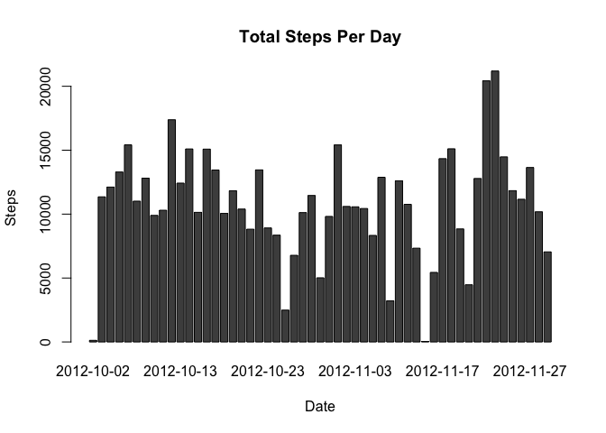
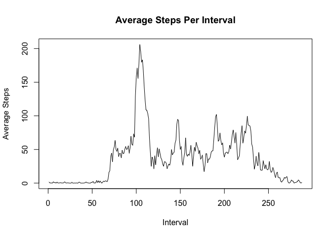
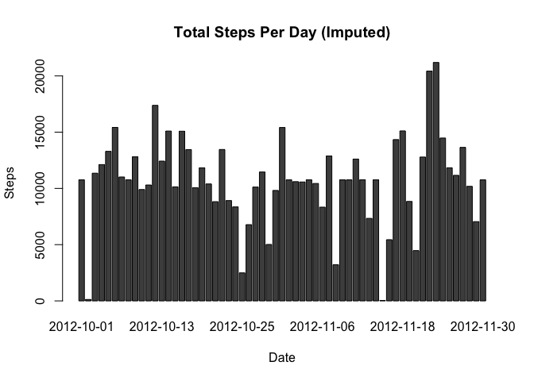
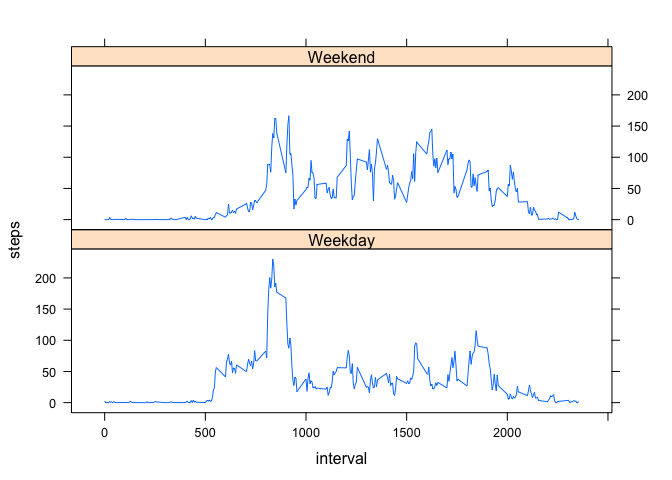

# Reproducible Research: Peer Assessment 1

### Set working directory, load required libraries

```r
setwd("~/Documents/Coursera/Reproducible Research/RepData_PeerAssessment1")
library(plyr)
library(lattice)
```

### Loading and preprocessing the data

```r
activity <- read.csv("activity.csv", header = TRUE)
```

## What is the mean total number of steps taken per day?


```r
stepspd <- ddply(activity, .(date), summarize, steps=sum(steps))
stepspd <- subset(stepspd, !is.na(steps))
meansteps <- as.integer(mean(stepspd$steps))
mediansteps <- as.integer(median(stepspd$steps))

mplot <- t(as.matrix(stepspd[-1]))
colnames(mplot) <- stepspd$date

barplot(mplot, main="Total Steps Per Day", xlab="Date", ylab="Steps")
```

<!-- -->

The mean total steps per day is 10766.  The median total steps per day is 10765.

## What is the average daily activity pattern?

```r
stepspi <- ddply(activity, .(interval), summarise, steps=mean(steps, na.rm=TRUE))
stepspi2 <- stepspi[-1]
plot.ts(stepspi2, main="Average Steps Per Interval", xlab="Interval", ylab="Average Steps")
```

<!-- -->

```r
indexarray <- which(stepspi==max(stepspi$steps), arr.ind = TRUE)
maxInterval <- stepspi[indexarray[1,1],1]
maxSteps <- round(stepspi[indexarray[1,1],2])
```

The 5 minute interval with the maximium average number of steps is interval 835 with 206 steps. 


## Imputing missing values


```r
naVals <- count(is.na(activity$steps))[2,2]
```
 
There are 2304 rows with NA values.

The strategy used to inpute missing values was to replace NA with the average steps for the interval, rounded to the nearest integer.


```r
activity2 <- activity
for(i in stepspi$interval){ 
  subi <- subset(stepspi, interval==i)
  activity2$steps[is.na(activity2$steps) & activity2$interval==i] <- round(subi[1,2])
}

stepspd <- ddply(activity2, .(date), summarize, steps=sum(steps))
meansteps2 <- as.integer(mean(stepspd$steps))
mediansteps2 <- as.integer(median(stepspd$steps))

mplot <- t(as.matrix(stepspd[-1]))
colnames(mplot) <- stepspd$date

barplot(mplot, main="Total Steps Per Day (Imputed)", xlab="Date", ylab="Steps")
```

<!-- -->

The mean total steps per day (imputed) is 10765.  The median total steps per day (imputed) is 10762.

Comparing omitting vs imputing NA values:
Mean (omitting NA values): 10766
Mean (imputing NA values): 10765
Median (omitting NA values): 10765
Median (imputing NA values): 10762


## Are there differences in activity patterns between weekdays and weekends?


```r
for(i in seq(activity2$date))
  if (weekdays(as.Date(activity2[i,2])) %in% c("Monday", "Tuesday", "Wednesday", "Thursday", "Friday")){
    activity2$dayofweek[i] <- "Weekday"  
  }else{
    activity2$dayofweek[i] <- "Weekend"  
  }

stepspi <- ddply(activity2, .(interval, dayofweek), summarise, steps=mean(steps, na.rm=TRUE))
stepspi$dayofweek <- as.factor(stepspi$dayofweek)

xyplot(steps ~ interval | dayofweek, data = stepspi, type = "l", layout=c(1,2))
```

<!-- -->
